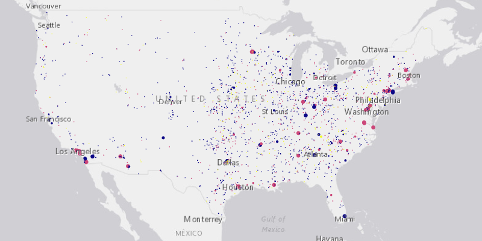

# Service feature table (no cache)

Display a feature layer from a service using the **no cache** feature request mode.

## Use case

`ServiceFeatureTable` supports three request modes, which define how features are requested from the service and stored in the local table. The feature request modes have different performance characteristics. Use **no cache** in scenarios where you always want the freshest data.

## How to use the sample

Run the sample and pan and zoom around the map. With each interaction, new features will be requested from the service and displayed on the map.

## How it works

1. Set the `ServiceFeatureTable.FeatureRequestMode` property of the service feature table to `ON_INTERACTION_NO_CACHE` before the table is loaded.
2. Add the table to the map using a `FeatureLayer`; features will be requested for the visible extent as the user pans and zooms.

## Relevant API

* FeatureLayer
* ServiceFeatureTable
* ServiceFeatureTable.FeatureRequestMode

## About the data

The U.S. National Bridge Inventory describes 600,000 bridges in the United States. The sample uses [US Bridges](https://arcgisruntime.maps.arcgis.com/home/item.html?id=250b103a722c4e1ea71e562eac61be1b), a modified copy of the U.S. National Bridge Inventory hosted on ArcGIS Online. The sample opens with an initial visible extent centered over Bridgeport, CT.

## Additional information

In **no cache** mode, features are automatically populated from the service for the visible extent. Each time the user pans and zooms, features are downloaded for the visible extent. Features are still cached in a local geodatabase for display, but the cache will always be populated with the latest data after navigation.

> **NOTE**: **No cache** does not guarantee that features won't be cached locally; feature request mode is a performance concept unrelated to data security.

## Tags

cache, feature request mode, performance
