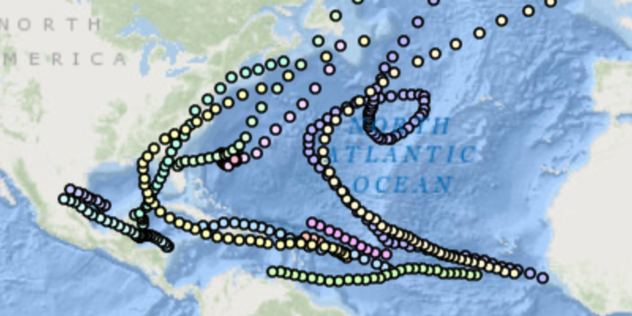

# Time-based query

Query data using a time extent. 

## Use case

This workflow can be used to return records that are between a specified start and end date. For example, records of Canada goose sightings over time could be queried to only show sightings during the winter migration time period.

## How to use the sample

Run the sample, and a subset of records will be displayed on the map.

## How it works

1. Create a `ServiceFeatureTable` from the URL of a feature service.
2. Set the feature table's feature request mode to manual with `featureTable.setFeatureRequestMode(MANUAL_CACHE)`.
3. After loading the service feature table, create `QueryParameters`.
4. Create two `Calendar` objects with the beginning and ending timestamps and create a `TimeExtent` with them.
5. Set the time extent with `queryParameters.setTimeExtent(timeExtent)`
6. Populate the table with features in the time extent with `featureTable.popuateFromServiceAsync(queryParameters, true, outputFields)`.
    * The second argument is whether to clear the cache of features or not.
    * The output fields is a list of fields of the features to return. Use a list of one string `"*"` to get all of the fields.
7. Finally, create a feature layer from the feature table with `new FeatureLayer(featureTable)`, and add it to the map with `map.getOperationalLayers().add(featureLayer)` to see the features in the time extent.

## Relevant API

* QueryParameters
* ServiceFeatureTable
* TimeExtent

## About the data

This sample uses Atlantic hurricane data from the year 2000. The data is from the National Hurricane Center (NOAA / National Weather Service).

## Tags

query, time, time extent
