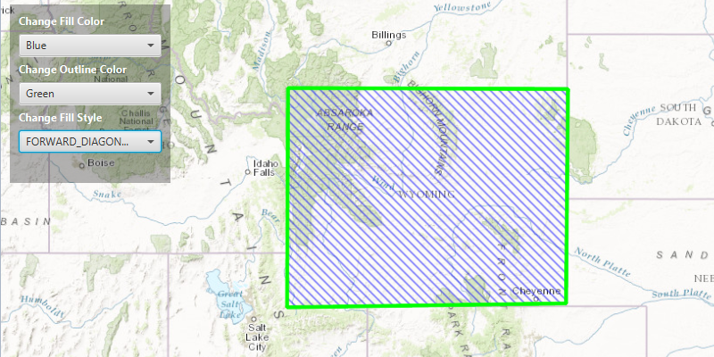

# Simple fill symbol

Change a graphic's fill color, outline color, and fill style properties.

## Use case

Customize the appearance of a graphic with a color and style scheme suitable for the data. For example, a polygon with a brown 'forward-diagonal' fill style could represent an area of artificial ground mapped on a geological map.  

## How to use the sample

Use the drop down menus in the control panel to change the fill color, outline color and fill style of the polygon.

## How it works

1.  Create a `Polygon` using a `PointCollection` to define its boundaries. 
2.  Create a `SimpleLineSymbol(SimpleLineSymbol.Style, color, width)`.
3.  Create a `SimpleFillSymbol(SimpleFillSymbol.Style, color, outline)`.
4.  Set the color, outline and style of the simple fill symbol object with:
	* `setColor()`;
	* `setOutline(simpleLineSymbol)`;
	* `setStyle()`;
5.  Create a new `Graphic` object, passing in the polygon and simple fill symbol as parameters, and add the graphic to the graphics overlay with `graphicsOverlay.getGraphics().add(new Graphic(polygon, fillSymbol))`.

## Relevant API

* Graphic
* GraphicsOverlay
* PointCollection
* Polygon
* SimpleFillSymbol
* SimpleLineSymbol

## Tags

fill, line, graphic, symbol
